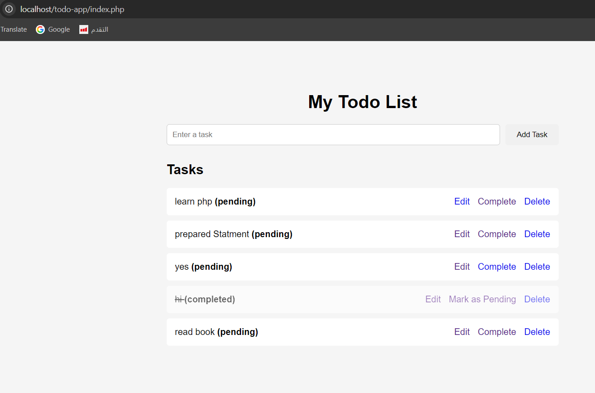

# PHP Todo App



A simple Todo List web application built with PHP and MySQL.

## Features

- Create new tasks
- View all tasks
- Edit tasks
- Delete tasks
- Mark tasks as completed
- Change completed tasks back to pending
- Input validation
- Prepared Statements
- MySQL database integration

## Technologies

- PHP
- MySQL
- HTML
- CSS
- XAMPP
- Composer
- Git
- GitHub

## Project Structure

- `index.php` - Displays all tasks
- `add.php` - Creates a new task
- `edit.php` - Displays the edit form
- `update.php` - Updates a task
- `delete.php` - Deletes a task
- `complete.php` - Marks a task as completed
- `pending.php` - Changes a task back to pending
- `db.php` - Database connection
- `db.example.php` - Example database configuration
- `database.sql` - Database schema
- `style.css` - Application styling

## Database Setup

1. Create the database using `database.sql`.
2. Configure the database connection using `.env`.
3. Start Apache and MySQL using XAMPP.
4. Place the project inside the XAMPP `htdocs` directory.
5. Open the application in your browser.

## Environment Configuration

Create a `.env` file in the project root:

```env
DB_HOST=localhost
DB_USER=root
DB_PASSWORD=
DB_NAME=todo_app
```
